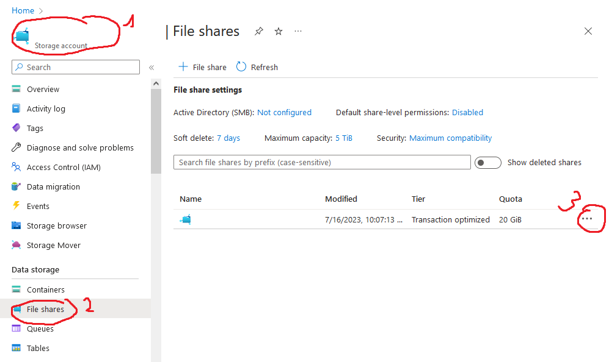

# cloud-mc

Azure Cloud based Minecraft setup :)

## Plans
- **Azure Container Instance** running linux minecraft server
  - 15 GB limit for container size
  - started & stopped on demand via bot
  - does not have persistence when not running
- **Azure Blob Storage** for backups [Plans](https://learn.microsoft.com/en-us/azure/storage/blobs/access-tiers-overview?tabs=azure-portal)
  - should have space for up to 3 backups at minimum (~ 500MB for a small world, don't know how large they get)
  - plan might not matter too much for our needs
- **Azure Cloud Function**
  - Implements bot functionality (either directly when using discord bot or indirectly for telegram bot)
  - Starting a container based with a function: https://learn.microsoft.com/en-us/azure/container-instances/container-instances-tutorial-azure-function-trigger
- **Telegram** or **Discord bot** for administration
  - telegram has a polling-based model, i.e. a bot actively runs an event loop, reacting to interactions
    - [node-telegram-bot-api](https://www.npmjs.com/package/node-telegram-bot-api) node.js lib
  - discord has a web hook based model (push-based), i.e. it could be run in an Azure Cloud Function itself

## Azure commands from powershell

You need to set up azure cloud shell first.

- Open windows terminal
- Click the little arrow and select "Azure Cloud Shell"
- Follow the instructions on screen & in the browser
- Afterwards, you can return to your terminal and press Enter to re-activate the shell there

### Setting a quota for a storage

Select the storage account, then follow these steps (with the appropriate type of storage):



### Creating a container with a file share

```
az container create -g MinecraftServer --name minecraft-server --image marctv/minecraft-papermc-server:latest --azure-file-volume-share-name minecraft --azure-file-volume-account-name minecraft20230716 --azure-file-volume-mount-path "/data" --restart-policy Never --cpu 1 --memory 4 --dns-name-label cloud-mc --ports 25565 --os-type Linux -e "EULA=TRUE OPS=chamelopi" --location "west europe"
```

With `az container create`, you can also use the `-f` flag to pass a docker-compose file? (I did not test this, but it seems likely)